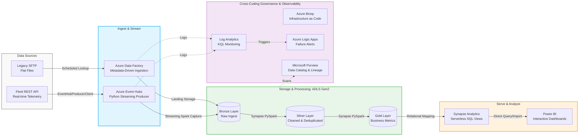

# Fleet Data Platform Modernisation

## 🏗️ Lambda Architecture & Platform Mapping

The platform implements a Lambda Architecture to handle both metadata-driven batch historical data and real-time fleet telemetry streams using the Azure Ecosystem.

An end-to-end enterprise Azure data platform simulating a legacy fleet telematics system modernization. This project replaces brittle, manual SFTP flat-file processes with a metadata-driven ingestion framework, a real-time event streaming architecture, and robust infrastructure monitoring.

---

## 🛠️ Tech Stack & Platform Components
- **Infrastructure as Code (IaC):** Azure Bicep (Modular provisioning)
- **Data Ingestion & Streaming:** Azure Data Factory (Metadata-driven JSON), Azure Event Hubs (Python `EventHubProducerClient`)
- **Storage & Compute:** Azure Data Lake Storage Gen2, Azure Databricks (PySpark), Azure Synapse Analytics
- **Data Transformation:** Medallion Architecture (Delta Lake tables)
- **Observability & Governance:** Azure Logic Apps, Log Analytics (KQL), Microsoft Purview
- **CI/CD & Version Control:** GitHub, GitHub Actions

---

## 📈 Project Roadmap & Implementation Phases

### Phase 1: Infrastructure & Automation (Completed)
*   **Infrastructure as Code:** Developed modular Azure Bicep files to provision all platform services, security frameworks, and network components deterministically.
*   **Pipeline Automation:** Configured a GitHub Actions workflow to enable a complete CI/CD deployment pipeline for infrastructure changes.

### Phase 2: Batch Ingestion Framework (Completed)
*   **Metadata-Driven Ingestion:** Built generic, scalable ADF pipelines driven by a central JSON config sheet. Uses `Lookup` and `ForEach` activities to pull bulk telematics data via secure SFTP.
*   **Secure Credential Management:** Enforced zero hardcoded strings by backing all system parameters and credentials with Azure Key Vault secret management.

### Phase 3: Infrastructure Observability & Alerting (Completed)
*   **Enterprise Alerting:** Configured an Azure Logic App workflow that hooks into core pipelines to send instant failure metrics and tracking updates.
*   **Centralized Logging:** Consolidated platform metrics into an Azure Log Analytics workspace. Developed custom Kusto Query Language (KQL) scripts to monitor pipeline errors, throughput, and system resource allocation.

### Phase 4: Real-Time Event Streaming (In Progress)
*   **Telemetry Stream:** Engineering a continuous Python client script utilizing `EventHubProducerClient` to mimic streaming GPS coordinates and engine data.
*   **Managed Identities:** Using secure Azure RBAC and Managed Identities for script-to-cloud secure authentication, completely bypassing legacy access keys.

### Phase 5: Medallion Processing & BI Serving (Upcoming)
*   **Bronze / Silver / Gold:** Implementing data cleansing, over-speeding event calculations, and business metric calculations using PySpark notebooks in Synapse Studio.
*   **Downstream Analytics:** Generating analytical relational views in Synapse Serverless pools for direct ingestion into an interactive Power BI operational monitor.

### Phase 6: Observability, Governance & Lineage (In Progress)
*   **Centralized Logging:** Consolidated all diagnostic and metric logs from Azure Data Factory and Databricks into an Azure Log Analytics workspace.
*   **Operational Intelligence:** Wrote custom Kusto Query Language (KQL) scripts to build monitoring alerts for pipeline failures, processing latency, and ingestion bottlenecks.
*   **Data Governance:** Implemented Microsoft Purview stubs to catalog data assets, map data lineages across the Medallion layers, and enforce data privacy compliance.

